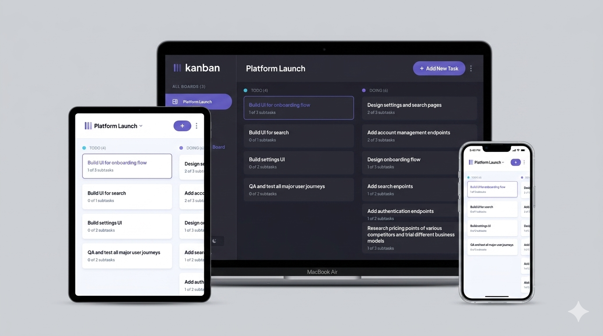

# 📋 Kanban Task Management Application

A responsive task management application built with modern Angular, with full CRUD functionality for boards, columns, tasks, and subtasks with reactive form validation. Implemented drag-and-drop task management using Angular CDK, enabling task reordering and movement across columns. Enhanced the user experience with reusable toast notifications, modals, and smooth light/dark mode switching.

---

## 💡 Key Features

🟣 Built using modern Angular with Standalone Components, Angular Signals, and Computed Signals for reactive state management and automatic UI updates.

🟣 Implemented full CRUD operations (Create, Read, Update, Delete) for boards, columns, tasks, and subtasks.

🟣 Integrated Angular CDK Drag & Drop to reorder tasks within columns and move tasks across different workflow stages.

🟣 Implemented Reactive Forms with validation for creating and editing boards, columns, tasks, and subtasks.

🟣 Added dynamic subtask management with real-time completion tracking.

🟣 Created reusable confirmation modals for deleting boards, columns, and tasks.

🟣 Added reusable toast notifications to provide instant feedback for user actions.

🟣 Built a fully responsive interface optimized for mobile, tablet, and desktop devices.

🟣 Implemented light and dark theme support with smooth theme switching.

🟣 Organized application logic using reusable services and centralized state management.

---

## 🛠️ Tech Stack

- Angular
- TypeScript
- Angular CDK
- Tailwind CSS
- HTML5
- CSS3

---

## 🔑 Key Concepts

- Standalone Components
- Angular Signals & Computed Signals
- Dependency Injection (DI)
- Services
- Reactive Forms
- Form Validation
- Component Communication
- CRUD Operations
- Angular CDK Drag & Drop
- Conditional Rendering
- Data Binding
- Responsive Design

---

## 💻 GitHub Repo & Live Demo

🔗 **GitHub Repo:** [Kanban Task Management App](https://github.com/Doaa182/Kanban-Task-Management-App)  
🌐 **Live Demo:** [View on Vercel](https://kanban-task-management-app-sigma.vercel.app/)

---

## 👩‍💻 Author

**Doaa Diaa El Din**

🔗 GitHub: https://github.com/Doaa182

---

## 📸 Screenshot

---
